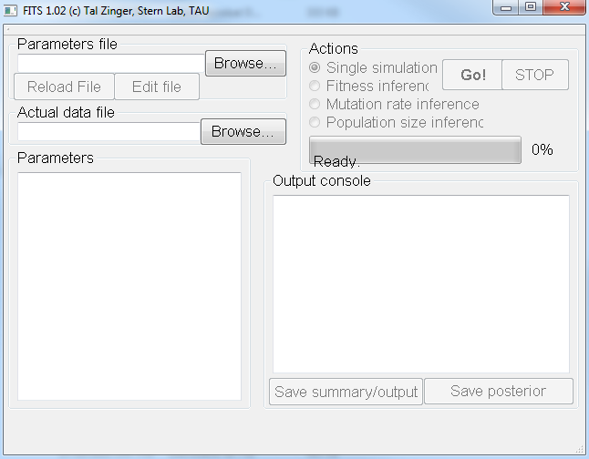
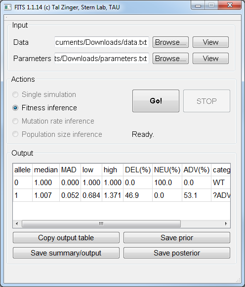

Using the graphical interface
=============================

.. note:: On Windows, please extract all files from the downloaded archive, and only then run the (extracted) executable. Running the program directly from the compressed archive will not work. 

After opening FITS, the following screen will be visible:

	
    FITS main screen.
	
Click the ``Browse...`` button near the ``Parameters`` label to load a parameters file (example :ref:`parameters_file`). 

.. note:: The loaded parameters may be viewed using the ``View`` button.

From the given parameters, FITS will automatically identify the possible inference mode (in the example below, Fitness inference mode). 

To load the data file, click ``Browse...`` near the ``Data`` label just below the ``Parameters`` label. Locate and select the :ref:`data_file`. 

.. note:: FITS expects the data file to be tab-delimited. If using Office Excel, save your worksheet as ``tab delimited`` file. 
	Verify the content and the format of the file if FITS fails to run.

Within the ``Actions`` area, FITS will automatically suggest available actions according to the parameters available in the parameters file. 
Press ``Go!`` to perform the selected action. FITS will show a progress bar and estimated time to completion. 

The inference results are given in the ``Output`` area. It may be copied to the clipboard (for example, to be pasted into a spreadsheet). Inference output, prior and posterior distributions may be exported to text files. 

    
    FITS after making an inference. 
	
The inference results are explained in the :ref:`results` page. 
