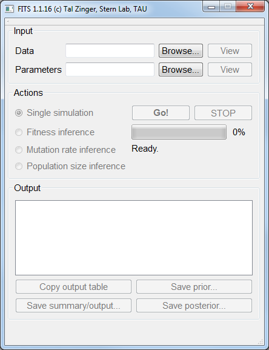

Using the graphical interface
=============================

After opening FITS, the following screen will be visible:

	
    FITS main screen.
	
Click the ``Browse...`` button near the parameters file. Load a parameters file (example :ref:`parameters_file`). 
Upon loading a parameters file, the parameters will be printed in the ``Parameters`` section to the bottom left:

.. figure:: screens/parameters_loaded.png
    :scale: 80%
    :align: center
    :alt: FITS main screen
    :figclass: align-center
	
    Parameters are presented on the bottom left area of FITS GUI.

From the given parameters, FITS will automatically identify the missing parameter in the file and will set its inference mode to this parameter (in the above example, Mutation rate inference mode). 

To load the actual data file, click ``Browse...`` near the ``Actual data file`` label just below the ``Parameters file`` label. Locate and open the :ref:`data_file`. 

Press ``Go!`` to perform the selected action. FITS will show a progress bar and estimated time to completion. 

The inference is given in the bottom right area, under ``Output console`` label. It can be exported to a text file, or the posterior distribution may be exported as well for a deeper analysis. 

	
    Inference results is located at the lower right area of FITS GUI.

.. note:: FITS expects the data file to be tab-delimited. If using Office Excel, save your worksheet as ``tab delimited`` file. 
	Verify the content and format of the file if FITS fails to run.
.. note:: Parameter value may be changed by pressing the ``Edit file`` button.