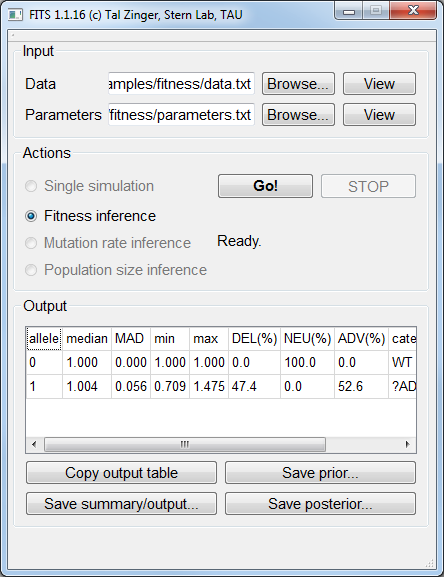

.. include:: <isonum.txt>

.. |POP_SIZE| replace:: 10\ :sup:`5`
.. |MUT_RATE| replace:: 10\ :sup:`-5`

Use cases
=========

.. _EnR:

Fitness inference
^^^^^^^^^^^^^^^^^
| In Evolve & Resequence (E&R) studies, a population is grown for a period of time under a given condition and sampled at several time points. 
  The frequencies of genetic variants or phenotypes for the different time points are measured, and we'd like to infer the fitness that is associated with each specific variant (or phenotype).
  An example for such frequency data, sampled for 15 generations and determined for frequency is described here: 

| The size of the population is estimated to be 100,000. Therefore the parameter ``N 100000`` was set.

| The mutation rate is estimated to 1:100,000 (or 10\ :sup:`-5`\). Therefore the parameter ``mutation_rate0_1 1e-05`` was set.

| We expect the fitness values of the phenomena to be between 0 (the minimum possible fitness value) and 2 (very adaptive fitness). Therefore the parameter ``min_fitness_allele1 0.0`` was set, to indicate zero minimal expected fitness and ``max_fitness_allele1 2.0`` as well, to indicate the maximal possible fitness value of two.

| The prior we chose for this analysis was smoothed_composite, a prior that is built towards typical fitness landscapes. Therefore the parameter ``fitness_prior smoothed_composite`` was set.

| We want the ABC framework to perform 100,000 simulations, and accept the fitness value from the best 1,000 simulations. 
  Therefore the parameter ``num_samples_from_prior 100000`` was set, to indicate 100,000 simulations, and the parameter ``acceptance_rate 0.01`` was set, to indicate that the top 1% simulations will be used to decide on the fitness value of this allele. 
     
The data file for a simulated neutral allele (fitness of 1) under a populations size of |POP_SIZE| and a mutation rate of |MUT_RATE| is available :download:`here <examples/fitness/data.txt>`. The corresponding parameters file is available :download:`here <examples/fitness/parameters.txt>`.

The inferred fitness value by FITS was practically 1:

	
    FITS inferred a fitness value of 1.004 for a simulated neutral allele. 

Mutation rate inference 
^^^^^^^^^^^^^^^^^^^^^^^
| A common problem is the inference of the rates of mutations between two (or more) alleles. 
  FITS supports such inference by harnessing prior knowledge about the fitness of the mutant allele(s) (say, from competition essay) and and the size of the population.
  A particular example for a case where such inference can be highly accurate is the usage of frequencies of multiple positions with equal fitness. 
  In many biological entities synonyomus mutations approach neutrality and therefore may be used for mutation rate inference. In this example we'll highlight how this can be done. 
  We simulated 10 independent loci using fitness value of 1, population size of 100,000 and mutation rate of 10\ :sup:`-5`\  and measured their frequencies for 15 generations. 

| The minimum and maximum considerable mutations rates should be provided within the parameters file, using the log value. 
  For this example, we use considerable mutation rates between 10\ :sup:`-7`\  and 10\ :sup:`-3`\, which will be defined between the wildtype allele (0) and the mutant allele (1) and vice-versa.
  For providing the minimal log mutation rate between the wildtype allele and the mutant we set ``min_log_mutation_rate0_1 -7`` and its reciprocal ``min_log_mutation_rate1_0 -7``.
  For providing the maximal log mutation rate between the wildtype allele and the mutant we set ``max_log_mutation_rate0_1 -3`` and its reciprocal ``max_log_mutation_rate1_0 -3``.
  
| We used neutral alleles and therefore set the wildtype and mutant alleles' fitness to be one: ``fitness_allele0 1.0`` and ``fitness_allele1 1.0``. 
   
The data file for simulated neutral alleles (fitness of 1) under a populations size of |POP_SIZE| and a mutation rate of |MUT_RATE| is available :download:`here <examples/mutation_rate/data.txt>`. The corresponding parameters file is available :download:`here <examples/mutation_rate/parameters.txt>`.

    FITS inferred 0 |rarr| 1 mutation rate of 8.67*10\ :sup:`-6`\, and 1 |rarr| 0 mutation rate of 1.15*10\ :sup:`-5`\. 

Population size inference
^^^^^^^^^^^^^^^^^^^^^^^^^
| If the mutation rates are known and the fitness of the measured allele is known, then the population size parameter may be inferred. 
  Similar to the mutation rate inference, this can be performed by using frequency data from several loci that has the same fitness values.
  Here we simulated 10 neutral positions for 15 generations, using a population size of 100,000 and a mutation rate of 10\ :sup:`-5`\.
  
| Our prior knowledge suggests that the population size may be in the range between 10\ :sup:`4`\  and 10\ :sup:`7`\. 
  We therefore set the parameter ``Nlog_min 4`` to indicate minimum population size of 10\ :sup:`4`\.
  We also set the parameter ``Nlog_max 7`` to indicate the maximum population size of 10\ :sup:`7`\.
  
| Our prior knowledge also suggests that the alleles we measured are neutral, and therefore we set the wildtype and mutant alleles to have a fitness of 1: 
  ``fitness_allele0 1.0`` and ``fitness_allele1 1.0``.
   
| Other parameters such as mutation rates, number of simulations and the sampling rate are similar to the :ref:`EnR` example. 
  The example data file is available :download:`here <examples/pop_size/data.txt>`. The corresponding parameters file is available :download:`here <examples/pop_size/parameters.txt>`.

	
    FITS inferred a population size of 5.18*10\ :sup:`5`\. 

Trajectory simulations
^^^^^^^^^^^^^^^^^^^^^^
| Sometimes, we wish to have frequency data generated. Since simulations are a cornerstone on which FITS is relying on, 
  it is possible to ask the framework to perform simulations of frequencies for given mutation rates, population size and fitness value. 
  
| In order to do so, we need to provide these three parameters as described in previous examples. 
  For this example, we'll use a mutation rate of 10\ :sup:`-3`\, a fitness of 1.02 and a population size of 10\ :sup:`5`\. 

| We wish to simulate two alleles only. We therefore set ``num_alleles 2`` to indicate two alleles. 

| We set for the two alleles the fitness values of 1 for the wildtype and 1.02 for the mutant: ``fitness_allele0 1.0`` and ``fitness_allele1 1.02``.

| We set the corresponding (equal) mutation rates: ``mutation_rate0_1 0.001`` and ``mutation_rate1_0 0.001``. 

| The population size is set by defining ``N 100000``.

| The last two things to consider are the frequency of the alleles in the beginning of the simulation, and the number of generations to simulate. 
  Here we will assume that the wildtype allele is fixated for the beginning of the simulation. We'll therefore set ``init_freq_allele0 1`` and ``init_freq_allele1 0``.
  To control for the number of generations (100 in our example) we set ``num_generations 100``.

.. note:: There's no need to load a :ref:`data_file` in order to perform the simulations.

	
    Simulation results are available in the **Output** area. 

Considering Sample Effect
^^^^^^^^^^^^^^^^^^^^^^^^^
| When performing serial passaging experiments, many times only a fraction of the progeny population is seeded. In order to account for bottleneck in the population (essentially an additional layer of drift), FITS uses the ``bottleneck_size`` parameter to account for sampling a given number of genomes from the general population. As this process is usually repetitive, FITS employs the ``bottleneck_interval`` parameter in order to continuously apply the bottleneck. For example, setting ``bottleneck_size K`` and ``bottleneck_interval T``, would cause a bottelneck size of T to be applied every T generations (see figure below).

| Sequencing mights give a biased view on the population. For example, for a population of 10\ :sup:`6`\ only 200 genomes might be actually sequenced. FITS can account for this sample effect using the ``sample_size`` parameter. If this parameter is used, the frequency data given as output (single trajectory) or used for comparison against the experimental data (durig inference) comes from re-sampling the population (see figure below).

.. figure:: screens/bottleneck_sample.png
    :scale: 70%
    :align: center
    :alt: Bottleneck vs. sample size
    :figclass: align-center

| Recapitulating the above example, we generated trajectories with ``N 1000000``, ``sample_size 200`` and fitness value of w=0 (data available here, parameters here),1 (data available here, parameters here),1.5 (data available here, parameters here) for the mutant allele. For w=0,1 the trajectories looked the same, with mutant frequency remaining 0. For w=1.5 the mutant allele was observed at a single copy number for one generation:

| Assuming no sampling (parameters file available here), only an extremely deleterious allele would show such trajectories. FITS, as expected infers the fitness of the allele to be w=0 for all three cases (w=0,1,1.5).
| In contrast, applying sampling to the simulation process (parameters file available here) give more informative results. For w=0,1 which look essentially the same, FITS infers w=0.7, and for w=1.5 it infers w=1.03. All latter results show wide range of probable values in the posterior distribution (0.0-1.4 and 0.0-1.6 respectively).
| We believe the sample-size parameter could be helpful both for improving accuracy of inference as well as for exploratory purposes.

